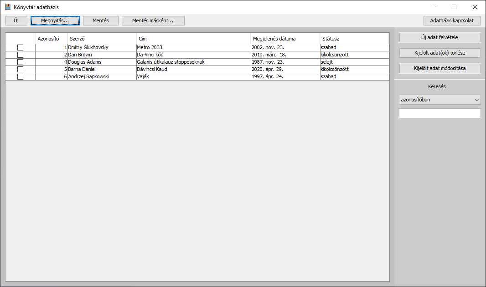

Java programozás
================
Féléves feladat
===============

*Könyvtár - könyvek: azonosító, szerző, cím, megjelenés dátuma, státusz (szabad,
kikölcsönzött, selejt)*

Böszörmenyi Daniel

O6385D

2020. április 05.

Az adatszerkezet
================

A program által kezelt adatok szerkezete egy könyvtár leltárát valósítja meg.

Könyvtár - könyvek:

azonosító - Integer

szerző - String

cím - String

megjelenés dátuma – Dátum (/Long)

státusz – String (szabad/kikölcsönzött/selejt)

Megvalósított bemeneti tárolók
==============================

A programban kezelhető fájlok a következők: .csv, .json, .db (SQLite adatbázis
fájl). Ezen fájlok olvasása a programban lévő „Megnyitás” gomb utáni tallózás
lehetőségével történhet, vagy adatbázis kapcsolat esetén az ugyanígy
feliratozott gombra kattintva.

Megvalósított kimeneti tárolók
==============================

A program az általa olvasható összes fájl írására is képes, tehát képes
létrehozni .csv, .json fájlokat is, de új adatbázist is képes készíteni. Ezeket
képes a „Mentés másként…” opció logikája alapján is elkészíteni, de a
felhasználó indítás után választhatja az „Új fájl” létrehozása opciót is, ami
egy üres fájlt hoz létre számára, amit kedve szerinti (az adatszerkezetet
betartva) új adatokkal tölthet fel.

Be- és kimeneti tárolók képekben
================================

 A program futtatási képei és funkciók ismertetése
==================================================

A program indításkor megjelenő főablaka

A főablak, miután valamilyen fájlból olvasásra kerültek adatok

A mentés gomb nem dob munkaablakot, csak felugró ablak formájában értesítést a
sikeres, vagy sikertelen mentések esetén. (Lásd: *Hiba-/Információs üzenet
ablakok* részben a későbbiekben)

Adatkezelés:

A törlés gomb nem dob felugró ablakot, csak a kijelölt adatokat törli a
táblamodellből.

Minden karakter bevitele, vagy törlése után újra alkalmazza a szűrést a kijelölt

mező alapján.

Hiba- /Információs üzenetek ablakai

Adatbázis kapcsolat \> nem .db fájl választása

Megnyitás gomb \> olyan fájl kiválasztása, amely nem .csv, nem .json, vagy nem
.db

Új adat felvétele / Adat módosítása / Új fájl létrehozása / Mentés másként \>
Mező üresen hagyása

Mentés / Mentés másként \> Sikeres mentés

Adatbázis kapcsolat \> Sikeres kapcsolat

\+ Kivételek hibaüzenetei

*(Mindegyiket nem idézem elő, csak egy-két példát csatolok. Mindegyik kivétel
saját hibaüzenet ablakkal rendelkezik, ahol a kivétel típusa és üzenete is
megjelenik.)*

A .json fájl szintaktikája hibás. ( törölt } )

Egy asd.txt fájl neve lett átírva asd.db-re.

A program 3 külső JAR fájlt használ, ezek a következők:

sqlite-jdbc-3.30.1.jar

jdatepicker-1.3.4.jar

json-simple-1.1.1.jar

Ha ezek valamelyike nem található meg, akkor a program induláskor erre
figyelmeztet:

Ettől függetlenül a program elindul, azonban, ha olyan funkciót szeretne elérni
a felhasználó, ahol a csomagra szükség van, a funkció nem lesz használható:

Extra funkciók
==============

Keresés – a program el van látva egy kereső mezővel, ami segítségével a táblázat
összes mezője alapján lehet szűrést végezni.

Extra funkciónak tekinthető továbbá az új fájl létrehozása, tetszőleges
fájl(megfelelő adatszerkezet esetén) megnyithatósága és a mentés másként
funkció, ami az éppen megnyitott fájlt írja új, tetszőleges nevű, helyű fájlba.
